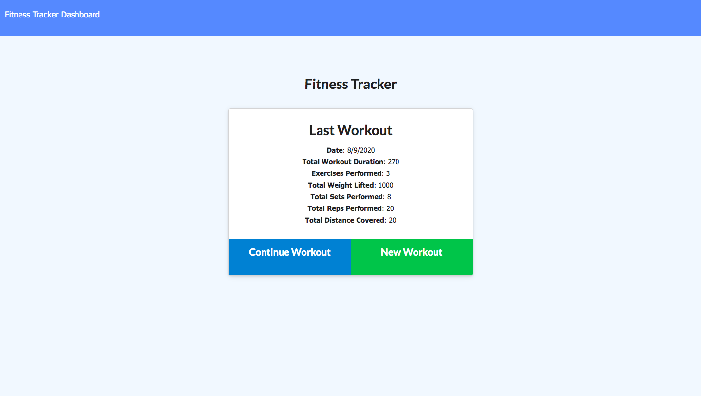
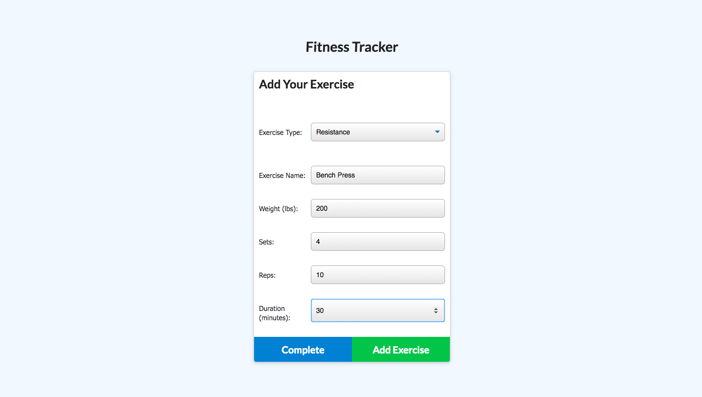
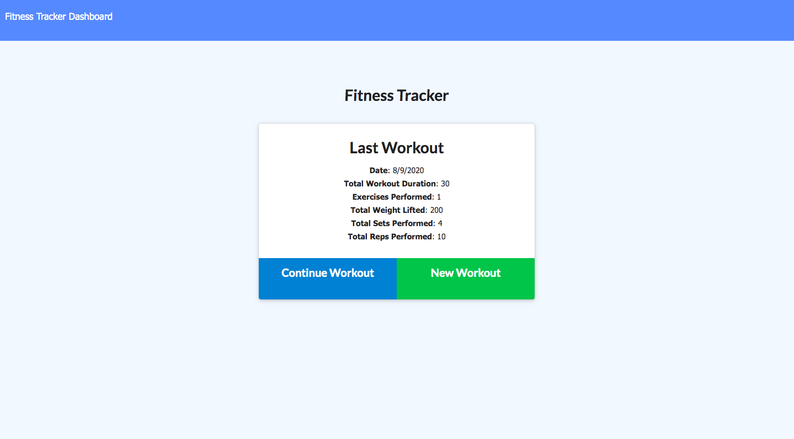
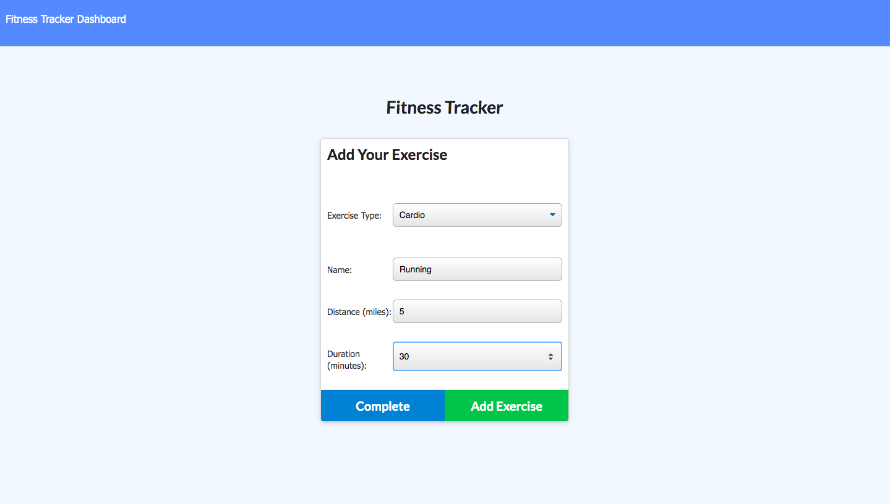
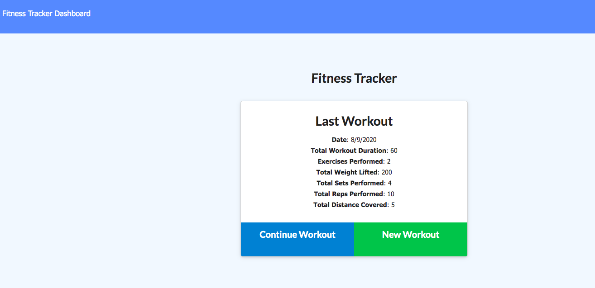
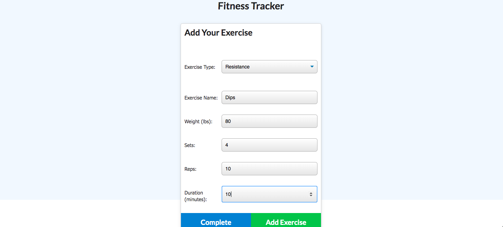
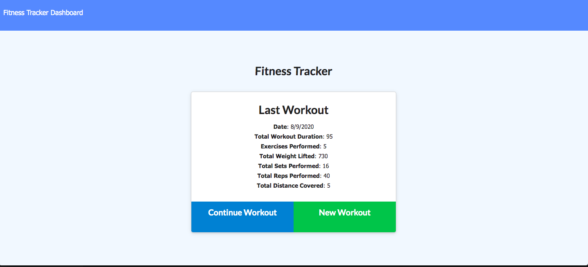

# Workout-Tracker

## Description

This application allows users to create and track their daily workouts.  The app tracks the name, type, weights, sets  reps, and duration  of the exercise and tracks the distance traveled for cardio based exercises. You can continue to add exercises on the given day or create a whole new workout. The workout is then saved for that given day.

## Click [here](https://workout-tracker123.herokuapp.com/?id=5ef685193eeb65001749e0bc)  for the live app. 

This is the homepage with previous data:

 
 
 User clicks on new workout and gets directed to new workout page:
 
  
 
 The user can now see their new workout displayed on the home screen when they click complete:
 
  
 
 The user can continue their workout and add more exercises:
 
 
 
 
 All the updated workout are added to the homepage:
 

 
 
 User can also continue to add exercises and then hit complete when they are finished:
  
 
 
 
 
 
 # Badges

## Installation

     
     - dotenv
     - express
     - express 
     - mongoose
     - mongoose_skeleton
     - Morgan
     

### Email:

        bml201095@gmail.com
        
